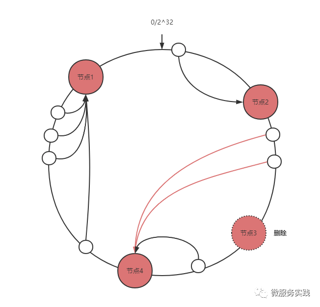

# 一致性Hash

## 理论介绍

### 为什么需要一致性哈希

首先介绍一下什么是哈希

Hash，一般翻译做散列，或音译为哈希，是把任意长度的输入（又叫做预映射pre-image）通过散列算法变换成固定长度的输出，该输出就是散列值。这种转换是一种压缩映射，也就是，散列值的空间通常远小于输入的空间，不同的输入可能会散列成相同的输出，所以不可能从散列值来确定唯一的输入值。简单的说就是一种将任意长度的消息压缩到某一固定长度的消息摘要的函数。

对于分布式存储，不同机器上存储不同对象的数据，我们使用哈希函数建立从数据到服务器之前的映射关系。

* 哈希取模
`m = hash(o) mod n`

其中，o为对象名称，n为机器的数量，m为机器的编号

考虑以下例子：

3个机器节点，10个数据的哈希值分别为1,2,3,4,…,10。使用的哈希函数为：(m=hash(o) mod 3)

```text
机器0 上保存的数据有：3，6，9
机器1 上保存的数据有：1，4，7，10
机器2 上保存的数据有：2，5，8
```

当增加一台机器后，此时n = 4，各个机器上存储的数据分别为：

```text
机器0 上保存的数据有：4，8
机器1 上保存的数据有：1，5，9
机器2 上保存的数据有：2，6，10
机器3 上保存的数据有：3，7
```

只有数据1和数据2没有移动，所以当集群中数据量很大时，采用一般的哈希函数，在节点数量动态变化的情况下会造成大量的数据迁移，导致网络通信压力的剧增，严重情况，还可能导致数据库宕机。

* 一致性哈希

一致性hash算法正是为了解决此类问题的方法，它可以保证当机器增加或者减少时，节点之间的数据迁移只限于两个节点之间，不会造成全局的网络问题。


### 一致性哈希


首先对节点进行哈希计算，哈希值通常在 2^32-1 范围内。然后将 2^32-1 这个区间首尾连接抽象成一个环并将节点的哈希值映射到环上，当我们要查询 key 的目标节点时，同样的我们对 key 进行哈希计算，然后顺时针查找到的第一个节点就是目标节点。

根据原理我们分析一下节点添加和删除对数据范围的影响。

* 节点添加


只会影响新增节点与前一个节点（新增节点逆时针查找的第一个节点）之间的数据。

* 节点删除



只会影响删除节点与前一个节点（删除节点逆时针查找的第一个节点）之间的数据。

* 存在的问题

当集群中的节点数量较少时，可能会出现节点在哈希空间中分布不平衡的问题。如下图所示，图中节点A、B、C分布较为集中，造成hash环的倾斜。数据1、2、3、4、6全部被存储到了节点A上，节点B上只存储了数据5，而节点C上什么数据都没有存储。A、B、C三台机器的负载极其不均衡。


怎么解决呢？不是粒度太粗吗？那就加入更多的节点，这就引出了一致性哈希的虚拟节点概念，虚拟节点的作用在于让环上的节点区间分布粒度变细。

一个真实节点对应多个虚拟节点，将虚拟节点的哈希值映射到环上，查询 key 的目标节点我们先查询虚拟节点再找到真实节点即可。


## 代码思路实现

基于上面的一致性哈希原理，我们可以提炼出一致性哈希的核心功能：

<ol>
<li>添加节点</li>
<li>删除节点</li>
<li>查询节点</li>
</ol>

```go
type ConsistentHash interface {
	Add(node Node)
	Get(node Node) Node
	Remove(node Node)
}
```

现实中不同的节点服务能力因硬件差异可能各不相同，于是我们希望在添加节点时可以指定权重。反应到一致性哈希当中所谓的权重意思就是我们希望 key 的目标节点命中概率比例，一个真实节点的虚拟节点数量多则意味着被命中概率高。

在接口定义中我们可以增加两个方法：支持指定虚拟节点数量添加节点，支持按权重添加。本质上最终都会反应到虚拟节点的数量不同导致概率分布差异。

```go
type ConsistentHash interface {
    Add(node Node)
    AddWithReplicas(node Node, replicas int)
    AddWithWeight(node Node, weight int)
    Get(node Node) Node
    Remove(node Node)
}
```

接下来考虑几个工程实现的问题：

<ol>
<li>虚拟节点如何存储</li>
用列表（切片）存储即可。
<li>虚拟节点 - 真实节点关系存储</li>
用map
<li>顺时针查询第一个虚拟节点如何实现</li>
让虚拟节点列表保持有序，二分查找第一个比 hash(key) 大的 index，list[index] 即可。
<li>虚拟节点哈希时会有很小的概率出现冲突，如何处理呢？</li>
冲突时意味着这一个虚拟节点会对应多个真实节点，map 中 value 存储真实节点数组，查询 key 的目标节点时对 nodes 取模。
<li>如何生成虚拟节点</li>
基于虚拟节点数量配置 replicas，循环 replicas 次依次追加 i 字节 进行哈希计算。
</ol>

## Go-Zero源码分析
`core/hash/consistenthash.go`

```go
// A ConsistentHash is a ring hash implementation.
type ConsistentHash struct {
	hashFunc Func
	// node的虚拟节点数量
	replicas int
	// 虚拟节点的hash值列表
	keys     []uint64
	// 虚拟节点hash到物理节点的映射，物理节点拉一个列表是为了处理hash冲突(常规做法)
	ring     map[uint64][]interface{}
	// 物理节点映射，为了快速查找node
	nodes    map[string]lang.PlaceholderType
	lock     sync.RWMutex
}
```

```go
// AddWithReplicas adds the node with the number of replicas,
// replicas will be truncated to h.replicas if it's larger than h.replicas,
// the later call will overwrite the replicas of the former calls.
func (h *ConsistentHash) AddWithReplicas(node interface{}, replicas int) {
	// 允许重复添加
	h.Remove(node)

	// 不能超过初始化设定的最大虚拟节点副本上限
	if replicas > h.replicas {
		replicas = h.replicas
	}

	// node对象序列化为字符串，作为key
	nodeRepr := repr(node)
	h.lock.Lock()
	defer h.lock.Unlock()
	// 添加节点map映射
	h.addNode(nodeRepr)

	for i := 0; i < replicas; i++ {
		// 创建虚拟节点
		hash := h.hashFunc([]byte(nodeRepr + strconv.Itoa(i)))
		// 添加虚拟节点
		h.keys = append(h.keys, hash)
		// 映射虚拟节点-真实节点
		// hashFunc可能会出现哈希冲突，所以采用追加操作
		// 虚拟节点-真实节点的映射对应的其实是个数组
		// 一个虚拟节点可能对应多个真实节点，当然概率非常小
		h.ring[hash] = append(h.ring[hash], node)
	}

	// 排序
	// 后面会使用二分查找虚拟节点
	sort.Slice(h.keys, func(i, j int) bool {
		return h.keys[i] < h.keys[j]
	})
}
```

```go
// Get returns the corresponding node from h base on the given v.
func (h *ConsistentHash) Get(v interface{}) (interface{}, bool) {
	h.lock.RLock()
	defer h.lock.RUnlock()

	if len(h.ring) == 0 {
		return nil, false
	}

	hash := h.hashFunc([]byte(repr(v)))
	// 二分查找
	// 因为每次添加节点后虚拟节点都会重新排序
	// 所以查询到的第一个节点就是目标节点
	// 取余则可以实现环形表效果，顺时针查找节点
	index := sort.Search(len(h.keys), func(i int) bool {
		return h.keys[i] >= hash
	}) % len(h.keys)

	// 虚拟节点->物理节点映射
	nodes := h.ring[h.keys[index]]
	switch len(nodes) {
	case 0:
		return nil, false
	case 1:
		return nodes[0], true
	default:
		innerIndex := h.hashFunc([]byte(innerRepr(v)))
		pos := int(innerIndex % uint64(len(nodes)))
		return nodes[pos], true
	}
}
```

## 参考链接

<a href="https://mp.weixin.qq.com/s/V8nOmxWchnK97aJLEeT6WA">微服务实践</a>